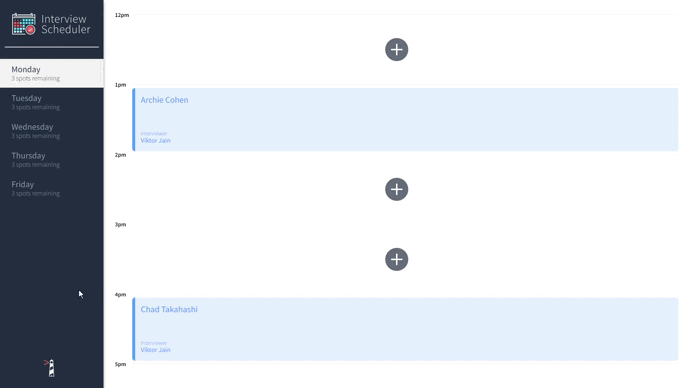
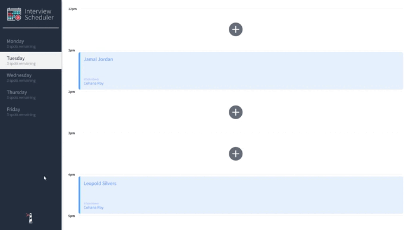

# Interview Scheduler

**_BEWARE:_ This client was published for learning purposes. It is _not_ intended for use in production-grade software.**

## Purpose
The Scheduler APP is created using Create React App while the API server is deployed using Express.

The App allows users to book technical interviews between students and mentors. Each appointment can be between the hours of 12 PM and 5 PM, Monday to Friday. Each student will have one interviewer.

This project contains implementation of React view library with databases. The server-side api implementation is located in this [repository](https://github.com/jayrmesa/scheduler-api).

## Application Functionality

A new student booking an appointment, by entering their name and selecting the day and the interviewer. With other functionality such as Edit and Delete:



Other functionality that handles cancel and error cases:



## Dependencies

- [Axios](https://www.npmjs.com/package/axios)
- [React](https://reactjs.org/) v16.9.0
- [React-dom](https://reactjs.org/) v16.9.0
- [React-scripts](https://reactjs.org/) v16.9.0
- [react-test-renderer](https://reactjs.org/docs/test-renderer.html) v16.9.0
- [Storybook](https://storybook.js.org/)
- [Node-sass](https://www.npmjs.com/package/node-sass)
- [@testing-library/react](https://testing-library.com/docs/react-testing-library/intro/)
- [@testing-library/jest-dom](https://testing-library.com/docs/dom-testing-library/intro)
- [Babel](https://babeljs.io/)

## Getting Started

For the application to run, you will need to have NPM installed. If you do not know what NPM is, please visit this [website](https://docs.npmjs.com/about-npm).

## Setup

_Prior to installation make sure you go into the directory where you would like scheduler to reside._ 

1. Clone the repo
  ```sh
  git clone git@github.com:jayrmesa/scheduler.git
  ```

2. Inside the scheduler directory, install all dependencies
  ```sh
  npm install
  ```

## Running Webpack Development Server

```sh
npm start
```

## Running Jest Test Framework

```sh
npm test
```

## Running Storybook Visual Testbed

```sh
npm run storybook
```
_**IMPORTANT:** The app is under <http://localhost:8000/> in your browser and for the users/students, inorder to see the data, scheduler-api must be running as well_ 

## Usage

Once the server is running, users will be able to see available says on the side tab.

The following features are available upon application launch:
- Interviews can be booked between Monday and Friday with number of spots available for each.
- A user can book an interview in an empty appointment slot by clicking the plus button.
- Interviews are then booked by typing in a student name and selecting an interviewer from a list.
- A user can cancel, edit and delete an existing interview.
- The application makes API requests to load and persist data. We do not lose data after a browser refresh.

_**Note:** the application simulates booking interviews on created interviewers. The scheduler is not in relation to a realtime calendar with notifications._

## Documentation

### stories

`index.js`: Storybook visual unit testbed for the individual components.

### src - components - \_\_tests\_\_

`Application.test.js`: Jest integration testing for Application behaviour.

`Appointment.test.js`: Jest unit test that the componant is rendered. 

`Button.test.js`: Jest unit tests for the Button component.

`DayListItem.test.js`: Jest unit test for the number of spots remaining displayed by the DayListItem component. 

`Form.test.js`: Jest unit tests on the Form component.

### src - helpers

`selectors.js`: api data into a format optimized for the data structure of the app.

`selectors.test.js`: Jest unit tests for the selector functions.

### src - hooks - \_\_tests\_\_

`useVisualMode.test.js`: Jest unit tests for the corresponding custom hooks.

`useApplicationData.js`: Custom hooks to modify appointments, contains WebSocket server connection.

`useVisualMode.js`: A custom hook that uses a data stack to manage form views for the appointments.

### reducers

`application.js`: Contains the reducer function for days, application and interview.

`application.test.js`: Single Jest unit test for error handling in the reducer function.

### src - \_\_mocks\_\_

`axios.js`: static data to replace API fetching when testing with Jest.

### cypress - integration

`appointments.spec.js`: End-to-end testing to add, edit and cancel appointments.

`navigation.spec.js`: End-to-end testing to change the selected day.

